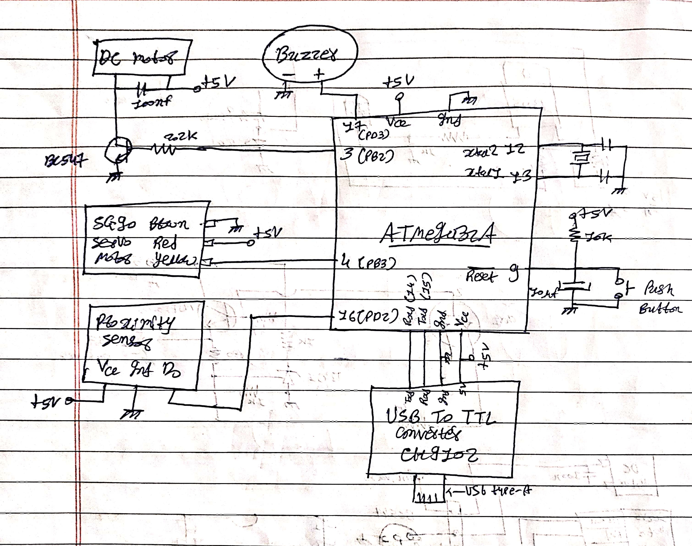

# Driver Safety System & Smart Cockpit

A real-time Advanced Driver Assistance System (ADAS) that monitors driver alertness using AI and takes physical control of a vehicle model when the driver falls asleep. 

This project integrates a responsive, first-person web dashboard (Cockpit HUD) with an ATmega32A microcontroller. It features live Eye Aspect Ratio (EAR) tracking, real-time traffic monitoring via IR sensors, and automated vehicle takeover protocols.

## 🌟 Features
* **Zero-Latency AI Eye Tracking:** Uses Google MediaPipe to calculate EAR and detect drowsiness instantly.
* **Smart Hardware Takeover:** ATmega32A automatically triggers emergency braking or safe cruising based on traffic proximity when the driver is asleep.
* **Responsive Web Cockpit:** A Flask-based HUD showing live video feed, hardware telemetry, and interactive controls for steering (Servo) and speed (PWM DC Motor).
* **Fail-Safe Manual Override:** Physical and GUI-based takeover buttons to safely return control to the driver.

---

## 🛠️ Hardware Requirements
* **Microcontroller:** Bare ATmega32A (with 16MHz Crystal Oscillator).
* **Programmer:** USBasp (for flashing firmware/bootloader).
* **Serial Communicator:** CH9102 USB-to-TTL Converter.
* **Actuators:** SG90 Servo Motor (Steering), DC Motor with TIP122 Transistor (Wheels).
* **Sensors:** IR Proximity Sensor, 5V Active Buzzer, Push Button.
* **Camera:** Android Phone via IP Webcam (or any standard webcam).

---

## 🔌 Circuit Diagram & Connections


*crystal is 16mhz and capacitors across it's is 22pf*

🔸instead of bc547 use TIP122 transistor 

**ATmega32A Pin Mapping (MightyCore Standard):**
* `Pin 3 (PB2)` ➔ DC Motor (via TIP122 Base resistor) - *PWM Speed Control*
* `Pin 4 (PB3)` ➔ SG90 Servo Motor (Signal/Yellow wire) - *Steering*
* `Pin 16 (PD2)` ➔ IR Proximity Sensor (OUT) - *Traffic detection*
* `Pin 17 (PD3)` ➔ Buzzer (+) - *Wake-up Alarm*
* `Pin 20 (PD6)` ➔ Push Button (to GND) - *Manual Takeover*
* `Pins 12 & 13` ➔ 16MHz Crystal Oscillator (with 22pF capacitors to GND)
* `Pin 14 (RXD)` ➔ CH9102 **TXD** (Crossover connection)
* `Pin 15 (TXD)` ➔ CH9102 **RXD** (Crossover connection)

---

## ⚙️ Step 1: Microcontroller Setup (ATmega32A)

Brand new ATmega32A chips run at an internal 1MHz clock. You must configure the hardware fuses to use the 16MHz external crystal before uploading the main code.

### 1. Burn the Bootloader (Setting the Fuses)
1. Install [MightyCore](https://github.com/MCUdude/MightyCore) in the Arduino IDE.
2. Connect your **USBasp** to the ATmega32A (MOSI, MISO, SCK, RESET, VCC, GND).
3. **CRITICAL:** Short the **JP3 Jumper** on the USBasp (Slow SCK mode). The 1MHz chip cannot communicate at high speeds yet.
4. In Arduino IDE: Select `Board: ATmega32`, `Clock: 16 MHz external`.
5. Click **Tools > Burn Bootloader**. 

### 2. Upload the Firmware
1. **Remove the JP3 Jumper** from the USBasp (the chip is now running at 16MHz!).
2. Open the provided `arduino_code.ino` file.
3. Click **Sketch > Upload Using Programmer**.
4. Once uploaded, completely disconnect the USBasp.

---

## 💻 Step 2: Software Installation

This project runs on Python 3.11+. It uses a virtual environment to prevent dependency conflicts.

1. Clone the repository and navigate to the directory:
```bash
git clone https://github.com/mikey-7x/DSS-driver-safety-system.git
cd DSS-driver-safety-system
```

2.Create and activate a virtual environment:

•Windows:
```powershell
python -m venv .venv
.\.venv\Scripts\activate
```
•Linux/Mac:
```bash
python3 -m venv .venv
source .venv/bin/activate
```

3.Install the required libraries:

Note: MediaPipe MUST be downgraded to v0.10.9 to prevent submodule bugs on newer Python versions.
```powershell
python -m pip install opencv-python pyserial flask mediapipe==0.10.9
```
## 🔧 Step 3: Configuration
​Before running the Python script, you must configure your hardware ports and camera IP. Open dss_cockpit.py in your code editor and modify the variables at the top of the file:

HARDWARE CONFIGURATION

1. Check Windows Device Manager to find your CH9102 COM Port

COM_PORT = "COM3"

BAUD_RATE = 9600

4. Enter the IP address provided by your Android IP Webcam app
(Keep the /video at the end)

for example:
camera_source = "[http://192.168.](http://192.168.)x.x:8080/video" 


## 🚀 Step 4: Running the System

1.Connect your CH9102 USB-to-TTL Converter to your laptop and the breadboard.
2.Ensure the Serial wires are crossed (TX ➔ RX, RX ➔ TX) and they share a common GND.
3.Start the IP Webcam server on your Android phone.
4.Run the Python server:
```
python dss_cockpit.py
```
5.Open your web browser and go to: http://127.0.0.1:5000


## 🎮 Dashboard Controls
​START SYSTEM: Initializes the ADAS monitoring.
​GAS / BRAKE: Adjusts the PWM speed of the DC Motor.
​STEERING: Rotates the SG90 Servo.
​FULLY MANUAL: Disables AI monitoring and locks the car in manual control.
​
## ⚠️ Troubleshooting
​MCU OFFLINE in Dashboard: Check if the Arduino IDE Serial Monitor is open in the background (it locks the COM port). Close it and restart the script.
​WAITING... or Missing Data: Your TX/RX wires are likely backwards. Swap the connections between the CH9102 and the ATmega32A.
​AttributeError: module 'mediapipe' has no attribute 'solutions': You have a corrupted MediaPipe installation or a local file named mediapipe.py confusing the compiler. Ensure you installed exactly mediapipe==0.10.9.

